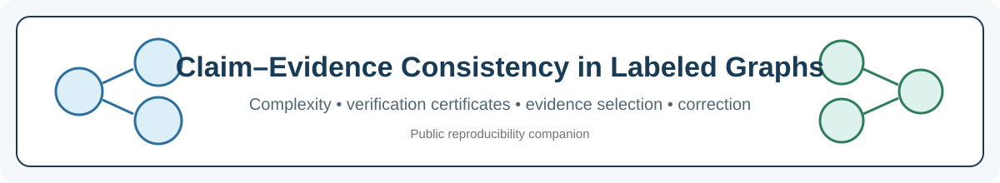
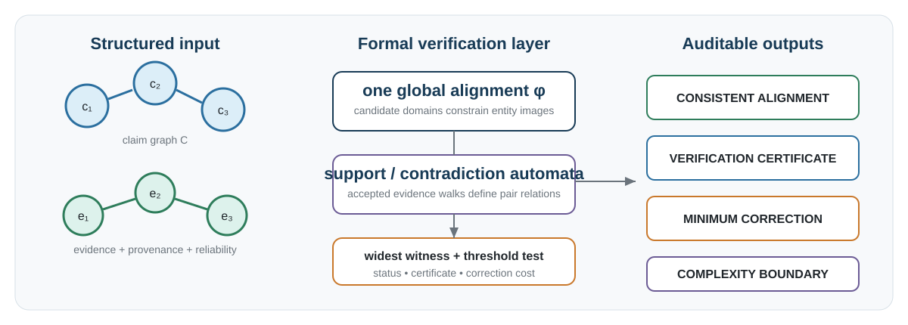
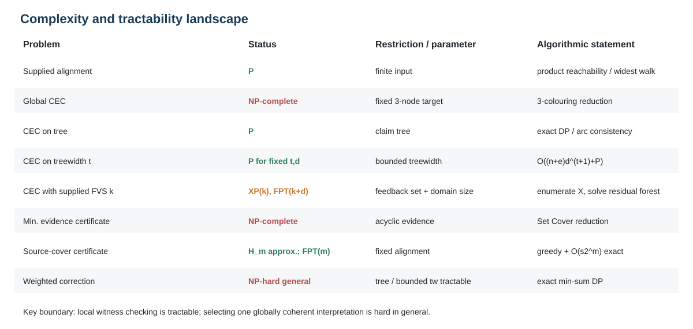
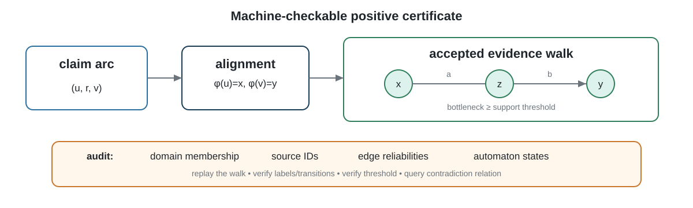

<p align="center">
  
</p>

<h1 align="center">Claim–Evidence Consistency in Labeled Graphs</h1>

<p align="center">
  <strong>Public reproducibility companion for</strong><br/>
  <strong>Claim–Evidence Consistency in Labeled Graphs: Complexity, Certificates, and Correction</strong>
</p>

<p align="center">
  <a href="https://github.com/SunilgarGusai/Claim-Evidence-Consistency-Reproducibility/actions/workflows/repository-validation.yml"></a>
  <a href="requirements.txt"></a>
  <a href="CITATION.cff"></a>
  <a href="LICENSE"></a>
  
  
</p>

<p align="center">
  <a href="#study-at-a-glance">Study</a> •
  <a href="#formal-model-at-a-glance">Formal model</a> •
  <a href="#main-results">Main results</a> •
  <a href="#reproducibility">Reproducibility</a> •
  <a href="#reviewer-map">Reviewer map</a> •
  <a href="#citation">Citation</a>
</p>

---

## Study at a glance

Evidence-grounded systems need more than independent labels for individual statements. If several claims reuse an entity, a verifier should not silently change the entity interpretation from one claim to another. This repository accompanies a theory-first study that represents generated assertions as a **claim graph**, curated/retrieved knowledge as an **evidence graph**, and verification as one globally coherent candidate-constrained alignment with automata-defined support and contradiction walks.

> **Central distinction:** checking a supplied interpretation is polynomial, while finding one globally coherent interpretation is NP-complete in general.

The computational material here validates the reference algorithms and theorem boundary cases. It is **not** an LLM benchmark and does not report language-model accuracy.

## Formal model at a glance

<p align="center">
  
</p>

The formal layer uses:

- a directed labeled claim graph and evidence graph;
- candidate domains for claim-to-evidence entity alignment;
- finite automata defining support and contradiction languages;
- bottleneck reliability thresholds for accepted evidence walks;
- provenance-bearing verification certificates;
- minimum evidence selection and minimum local correction.

The upstream extraction of claims, entities, relations, candidate domains, provenance labels, and reliability values is intentionally outside the formal guarantees.

## Main results

| Problem / regime | Frozen result |
|---|---|
| Supplied alignment verification | Polynomial via product-graph reachability / widest accepted walks |
| Global claim–evidence consistency | NP-complete even under severe restrictions |
| Claim trees | Exact dynamic programming; binary arc consistency is complete |
| Bounded treewidth | Exact dynamic programming with explicit domain-size dependence |
| Supplied feedback vertex set | Exact cycle-cutset specialization; XP in feedback-set size alone, FPT in feedback-set size + domain size |
| Reliability perturbation | Positive consistency margin certifies stability under bounded reliability changes |
| Minimum evidence certificate | NP-complete even on restricted acyclic evidence graphs |
| Source-cover abstraction | Greedy harmonic approximation and exact `O(s 2^m)` algorithm |
| Weighted local correction | Exact min-sum algorithms on trees and bounded-treewidth claim graphs |

<p align="center">
  
</p>

## Frozen computational validation

The submission-ready artifact records:

- **12 / 12** unit tests passing;
- **100 / 100** tree consistency decisions agreeing with exhaustive alignment search;
- **60 / 60** supplied-feedback-set decisions agreeing with exhaustive search;
- **60 / 60** weighted-correction instances agreeing with exhaustive optimization;
- maximum weighted-correction discrepancy below **9 × 10⁻¹⁶** (floating-point arithmetic);
- deterministic scalability experiments through **5,000 claim vertices** and candidate-domain size **12**;
- **180** evidence-cover instances compared with exact bitmask optima;
- fixed random seed **20260712**.

Machine-readable values are in [`results/frozen/`](results/frozen/) and summarized in [`docs/FROZEN_RESULTS.md`](docs/FROZEN_RESULTS.md).

## Reproducibility

This repository is an **auditable scientific artifact**, not a mirror of the private manuscript package.

```bash
conda env create -f environment.yml
conda activate claim-evidence-tcs

pytest -q
python scripts/validate_public_artifact.py
python scripts/reproduce_validation.py
python scripts/generate_figures.py
```

The same core checks run in GitHub Actions on pushes and pull requests to `main`.

The manuscript PDF/LaTeX source, cover letter, graphical-abstract file, author photographs, and journal-portal files are intentionally excluded from the public repository. See [`docs/REPRODUCIBILITY.md`](docs/REPRODUCIBILITY.md).

## Reviewer map

| Reviewer need | Start here |
|---|---|
| Exact formal construction | [`docs/METHOD_PROTOCOL.md`](docs/METHOD_PROTOCOL.md) |
| Main theorem/result inventory | [`docs/FROZEN_RESULTS.md`](docs/FROZEN_RESULTS.md) |
| Product-automaton/widest-witness code | [`src/automata_support.py`](src/automata_support.py) |
| Tree exact algorithm | [`src/tree_dp.py`](src/tree_dp.py) |
| Bounded-treewidth implementation | [`src/treewidth_dp.py`](src/treewidth_dp.py) |
| Feedback-vertex-set implementation | [`src/fvs.py`](src/fvs.py) |
| Certificate construction/checking | [`src/certificates.py`](src/certificates.py) |
| Evidence-cover algorithms | [`src/evidence_cover.py`](src/evidence_cover.py) |
| Reproduce frozen numerical validation | [`scripts/reproduce_validation.py`](scripts/reproduce_validation.py) |
| Claim and interpretation boundaries | [`docs/CLAIM_BOUNDARIES.md`](docs/CLAIM_BOUNDARIES.md) |
| Claim-to-file inventory | [`REPOSITORY_MANIFEST.csv`](REPOSITORY_MANIFEST.csv) |

<p align="center">
  
</p>

## Repository structure

```text
.
├── .github/workflows/        automated reviewer-facing validation
├── config/                   frozen experiment and semantic configuration
├── docs/                     method, results, provenance, boundaries, reproducibility
│   └── assets/               repository scientific SVG visuals
├── examples/                 small synthetic illustrative instance
├── figures/                  regenerated computational figures
├── manuscript/               note explaining submission-file exclusion
├── results/frozen/           machine-readable frozen outputs
├── scripts/                  validation and regeneration entry points
├── src/                      reference algorithms
├── tests/                    unit and algorithmic checks
├── QUICKSTART.md
├── CITATION.cff
├── environment.yml
├── requirements.txt
└── REPOSITORY_MANIFEST.csv
```

## Scientific scope and limitations

This repository establishes reproducibility of the **formal algorithms and their computational validation**. It does not establish that any particular claim extractor, retriever, NLI model, LLM, reliability estimator, or knowledge source satisfies the model assumptions. Reliability perturbation bounds are deterministic sensitivity statements under the stated bottleneck semantics; they are not probabilistic confidence intervals. The feedback-vertex-set algorithm is a model-specific specialization of a classical CSP cycle-cutset/backdoor principle, not a new general CSP metatheorem.

See [`docs/CLAIM_BOUNDARIES.md`](docs/CLAIM_BOUNDARIES.md) for the complete interpretation boundary.

## Release status

**Current status: submission-ready reproducibility repository.**

The frozen public snapshot is [`v1.0.0-submission`](https://github.com/SunilgarGusai/Claim-Evidence-Consistency-Reproducibility/releases/tag/v1.0.0-submission). Publication metadata and the article DOI can be added after publication. The live `main` branch remains reviewer-facing; the frozen release should be used when citing the exact frozen computational state prepared for submission.

## Authors

- **Sunilgar L. Gusai** — corresponding author, Marwadi University; ORCID: [0009-0004-0739-4812](https://orcid.org/0009-0004-0739-4812)
- **Manoharsinh R. Jadeja** — Marwadi University; ORCID: [0000-0003-1833-4730](https://orcid.org/0000-0003-1833-4730)

## Citation

Citation metadata are supplied in [`CITATION.cff`](CITATION.cff). Please cite the associated article when final bibliographic metadata become available.

## License

Original project code is released under the [`MIT License`](LICENSE). Synthetic example data are released under CC BY 4.0; third-party software retains its own terms. See [`THIRD_PARTY_LICENSES.md`](THIRD_PARTY_LICENSES.md).
